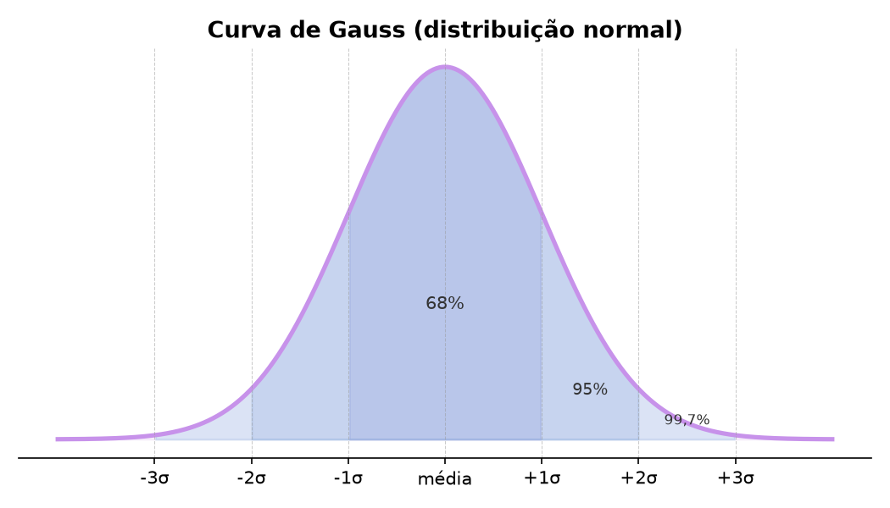

<!-- .slide: class="title-slide" -->

# Enc. 2

## Correlação de Pearson

🔗 Bloco 1: Associação

scipy.stats.pearsonr · pandas DataFrame.corr(method='pearson')

---

## 🍊 Metáfora

Pense em dois atletas correndo numa pista lado a lado.

- Quando um acelera, o outro acelera na mesma proporção; quando desacelera, o outro acompanha → **r = +1**.
- Quando um acelera e o outro desacelera na mesma medida → **r = −1**.
- Quando cada um faz o que quer, independentemente do outro → **r ≈ 0**.
- Pearson mede essa sincronia, mas *apenas quando a pista é reta*.

---

## 📈 O que é uma "pista reta"?

- Ao plotar X × Y num scatter plot, os pontos formam uma **reta**: cada aumento de X gera um acréscimo **constante** em Y.
- Pearson mede o quanto os pontos se aproximam dessa reta.

--

- Imagine agora que os dois atletas correm num trecho <strong>plano</strong>, lado a lado, em perfeita sincronia. A pista encontra uma <strong>colina</strong>. Na subida, um deles tem mais força e mantém o ritmo; o outro cansa e desacelera, e a sincronia que existia no plano se desfaz.
- Resultado: o padrão muda de comportamento ao longo do percurso (uma reta, depois uma subida), ou seja, não existe uma única reta que descreva bem todo o trajeto. Dependendo do tamanho da subida em relação ao trecho plano, <em>r</em> pode cair bastante, chegando perto de 0 mesmo havendo um padrão bem claro no gráfico.

Por isso: sempre olhe o scatter plot antes de confiar no valor de <em>r</em>.

---

## 💬 Exemplo em dados conversacionais

Cruzamos duas fontes por estudante: o número de **mensagens trocadas** no chat, extraído dos logs de um chatbot baseado em LLM, e o **escore composto em uma escala de metacognição** (ex.: Metacognitive Awareness Inventory), aplicada separadamente como questionário.

- **Pergunta:** estudantes que trocam mais mensagens têm maior consciência metacognitiva?
- **X:** número de mensagens · **Y:** escore composto no MAI.
- Antes de calcular *r*, plote um scatter plot (cada estudante vira um ponto no gráfico) e observe: os pontos sobem formando algo parecido com uma reta?

Outras variáveis conversacionais que também podem ser correlacionadas: tempo ativo no chat × nota final, número de mensagens × acertos em exercícios, latência média de resposta × duração da sessão.

---

## 🎯 Para que serve

Mede a **força** e a **direção** de uma relação *linear* entre duas variáveis numéricas contínuas. O coeficiente *r* vai de −1 a +1.

Em dados conversacionais: *quanto mais mensagens um estudante troca com o chatbot, maior o seu escore numa escala de metacognição?*

<strong>H₀:</strong> não há relação linear entre as variáveis (r = 0 na população). 
<strong>H₁:</strong> existe relação linear (r ≠ 0).

---

## 🧮 Fórmula

Como os atletas da metáfora: cada um se afasta da própria média, e <em>r</em> mede se isso acontece junto.

<table style="border-collapse:collapse; font-family: Georgia, 'Times New Roman', serif; font-size:1.3em; margin:8px auto;">
<tr>
<td rowspan="2" style="padding-right:12px; vertical-align:middle;"><em>r</em> =</td>
<td style="text-align:center; padding:2px 12px; border-bottom:2px solid currentColor;">Σ (xᵢ − x̄)(yᵢ − ȳ)</td>
</tr>
<tr>
<td style="text-align:center; padding:2px 12px;">√[ Σ(xᵢ − x̄)² × Σ(yᵢ − ȳ)² ]</td>
</tr>
</table>

<em>xᵢ, yᵢ</em>: valores de X e Y de cada estudante · <em>x̄, ȳ</em>: médias de X e de Y · Σ: soma para todos os estudantes · √: raiz quadrada.  
O numerador soma o produto dos desvios (o quanto X e Y "andam juntos"); o denominador normaliza esse valor pela dispersão de cada variável, por isso <em>r</em> fica sempre entre −1 e +1.

--

## 🪜 Passo a passo do cálculo

Como chegar de X e Y até o valor de <em>r</em>:

1. Calcule as médias x̄ e ȳ.
2. Para cada estudante, calcule os desvios (xᵢ−x̄) e (yᵢ−ȳ).
3. Multiplique os dois desvios e some tudo → **numerador**.
4. Some os desvios² de cada variável, multiplique os totais e tire a raiz → **denominador**.
5. **r** = numerador / denominador.

--

## 🧩 Aplicação simples: r na mão

Aplicando os passos acima a 5 estudantes fictícios · X = mensagens trocadas · Y = escore no MAI

| Est. | xᵢ | yᵢ | xᵢ−x̄ | yᵢ−ȳ | produto |
|:-:|:-:|:-:|:-:|:-:|:-:|
| A | 2 | 40 | −4 | −20 | 80 |
| B | 4 | 50 | −2 | −10 | 20 |
| C | 6 | 70 | 0 | 10 | 0 |
| D | 8 | 60 | 2 | 0 | 0 |
| E | 10 | 80 | 4 | 20 | 80 |

x̄ = 6 · ȳ = 60 · Σ produto = 180 · Σ(xᵢ−x̄)² = 40 · Σ(yᵢ−ȳ)² = 1000  
<em>r</em> = 180 / √(40 × 1000) = 180 / 200 = <strong>0,90</strong> → correlação positiva forte: quem trocou mais mensagens tendeu a ter maior escore no MAI.

---

## 🔢 O que significa r?

| Valor de *r* | Direção | Interpretação intuitiva |
|:-------------|:--------|:------------------------|
| **+1** | positiva | Quanto mais X, mais Y, em linha reta perfeita. |
| **0** | nenhuma | X e Y variam de forma independente. |
| **−1** | negativa | Quanto mais X, menos Y, em linha reta perfeita. |
| **entre 0 e ±1** | parcial | Há tendência, mas com dispersão em torno da reta. |

O sinal (+ ou −) indica a <strong>direção</strong>; o valor absoluto |r| indica a <strong>força</strong> da relação.  
<strong>Convenção de Cohen (1988):</strong> |r| &lt; 0,10 negligível · 0,10 a 0,29 pequeno · 0,30 a 0,49 médio · ≥ 0,50 grande.

---

## 📋 Quando usar

- ✅ Ambas as variáveis são contínuas e numéricas.
- ✅ A relação esperada é <strong>linear</strong> e os pontos, ao serem plotados, tendem a formar uma reta (não uma curva). Confira sempre com um scatter plot antes de calcular.
- ✅ Cada variável, isoladamente, deve seguir uma <strong>distribuição normal</strong>: a maioria dos estudantes envia um número "médio" de mensagens, e cada vez menos estudantes enviam quantidades bem abaixo ou bem acima dessa média. O teste de <strong>Shapiro-Wilk</strong> verifica isso.

--

## 📋 Evite Pearson quando

- ❌ Os dados são <strong>ordinais</strong>, como uma escala Likert de 1 a 5. Nesses casos, use Spearman.
- ❌ Há <strong>outliers extremos</strong>: um único ponto pode distorcer *r*.
- ❌ A nuvem de pontos é claramente <strong>curvilínea</strong>: Pearson não captura bem o padrão.
- ❌ Você quer afirmar <strong>causalidade</strong>: correlação só descreve associação.

--

## 🔔 O que é uma distribuição normal?

A curva de Gauss: simétrica, centrada na média, com caudas decrescentes.

Aproximadamente 68% dos dados ficam a até 1 desvio padrão da média, 95% a até 2 desvios padrão, e 99,7% a até 3 desvios padrão.

--

## 🔔 Teste de Shapiro-Wilk

O teste de normalidade mais usado antes de aplicar Pearson.

<strong>H₀:</strong> os dados vêm de uma população com distribuição normal. 
<strong>H₁:</strong> os dados não vêm de uma população com distribuição normal.

- **p ≥ .05** → não rejeitamos H₀: dados compatíveis com normalidade, Pearson pode ser aplicado.
- **p &lt; .05** → rejeitamos H₀: evidência de não normalidade, considere Spearman.

Cuidado: em amostras muito grandes, o teste pode rejeitar H₀ por desvios triviais. Sempre olhe também um histograma ou QQ-plot.

--

## 🐍 Exemplo Python: Shapiro-Wilk

  

    🐍 Python executável via <a href="https://pyodide.org" target="_blank">Pyodide</a>
    <button type="button" class="run-btn">▶ Executar</button>
  

  <textarea class="code-input" spellcheck="false"></textarea>
  <pre class="code-output"></pre>

--

Os números de 1 a 5 indicam apenas <strong>ordem</strong> (5 é mais concordância que 4), não uma régua com espaçamento igual entre eles. Pearson, porém, calcula a distância matemática entre os números como se 5 − 4 valesse exatamente o mesmo que 2 − 1.  
O problema: para uma pessoa, sair de "discordo" (2) para "neutro" (3) pode ser um salto de opinião muito maior do que sair de "concordo" (4) para "concordo totalmente" (5), mas, Pearson trataria os dois saltos como idênticos (ambos valem 1). Nesse caso, podemos usar <strong>Spearman</strong>, que veremos nas próximas seções.

---

## 🪜 Passo a passo na prática

1. **Visualize:** plote X × Y. A nuvem sobe, desce ou é um emaranhado?
2. **Verifique pressupostos:** normalidade univariada (Shapiro-Wilk) e ausência de outliers gritantes.
3. **Calcule:** `stats.pearsonr(x, y)` ou `df.corr(method='pearson')`.
4. **Interprete:** leia *r* (direção e força) e *p* (evidência contra H₀).
5. **Reporte:** informe *r*, *p*, *n* e, se possível, o scatter plot.

---

## 📖 Como ler o resultado

Suponha que o código abaixo retorne r = 0.87, p = 0.0003, com n = 10 estudantes:

- **r = 0,87** → relação linear <strong>forte e positiva</strong>: estudantes que trocam mais mensagens tendem a ter escore composto maior no MAI.
- **p &lt; .05** → rejeitamos H₀: a associação observada é improvável se não houvesse relação na população.
- **Cohen** → |0,87| ≥ 0,50 → tamanho de efeito <strong>grande</strong> (com *n* pequeno, a estimativa ainda é instável).

<strong>Correlação ≠ causalidade.</strong> Mais mensagens podem acompanhar maior consciência metacognitiva, ou estudantes mais metacognitivos simplesmente conversam mais e refletem mais sobre o próprio aprendizado.

---

## 🐍 Exemplo Python: Pearson

  

    🐍 Python executável via <a href="https://pyodide.org" target="_blank">Pyodide</a>
    <button type="button" class="run-btn">▶ Executar</button>
  

  <textarea class="code-input" spellcheck="false"></textarea>
  <pre class="code-output"></pre>

---

## 📚 Referências

- **clássico:** Cohen, J. (1988). *Statistical Power Analysis for the Behavioral Sciences* (2ª ed.). Lawrence Erlbaum.
- **didático:** Field, A. (2024). *Discovering Statistics Using IBM SPSS Statistics* (6ª ed.). SAGE. Cap. 8.
- **python:** McKinney, W. (2022). *Python for Data Analysis* (3ª ed.). O'Reilly. Cap. 13.
- **normalidade:** Shapiro, S. S., & Wilk, M. B. (1965). An analysis of variance test for normality (complete samples). *Biometrika, 52*(3/4), 591 a 611.

---

## 🔗 Materiais

[Conteúdo completo + código executável](../pearson.html)

[math.rpmhub.dev](https://math.rpmhub.dev)
